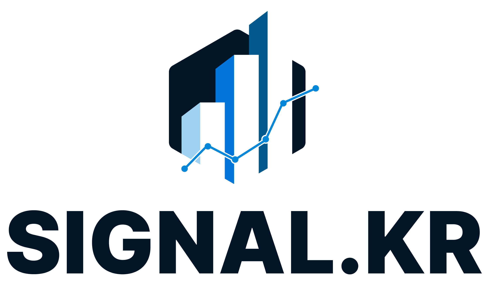

<p align="center">
  
</p>

# 🚀 3팀 프로젝트

## 📜 목차

- [팀원 및 담당 파트](#team)
- [사용 기술 (Tech Stack)](#tech-stack)
- [개발 워크플로우](#workflow)
- [브랜치 전략](#branch-strategy)
- [커밋 메시지 규칙](#commit-rules)
- [재무제표 OCR 분석 (`Python/Analyze`)](#analyze)
- [감성 분석 및 키워드 추출 (`Python/Prediction`)](#prediction)
- [주가 예측 파이프라인 (`Python/pipeline`)](#pipeline)
- [RPA (Britiy RPA)](#rpa)
- [Backend API 서버 (`Spring`)](#spring)
- [프론트엔드 (`React`)](#react)

---

## <a name="team"></a> 👨‍💻 팀원 및 담당 파트

| 담당            | 폴더명              | 이름   |
| :-------------- | :------------------ | :----- |
| Python 분석     | `Python/Analyze`    | 김민수 |
| Python 감성분석 | `Python/Prediction` | 이용범 |
| Python 예측     | `Python/pipeline`   | 이준범 |
| RPA             | `RPA`               | 오주희 |
| Spring          | `Spring`            | 전승원 |
| React           | `React`             | 변진환 |

---

## <a name="tech-stack"></a> 🛠️ 사용 기술 (Tech Stack)

### Frontend (React)

- **Framework**: `React`
- **Build Tool**: `Vite`
- **Routing**: `react-router-dom`
- **State Management**: React Context API
- **Charting**: `recharts`
- **WebSocket**: `@stomp/stompjs`, `sockjs-client`
- **Styling**: `App.css` (기본 CSS), 컴포넌트 기반 스타일링
- **Linting**: `ESLint`
- **Backend Services**: `firebase` (인증 등)
- **Etc**: `@isoterik/react-word-cloud` (워드 클라우드), `html2canvas` (HTML 캡처)

### Backend (Spring)

- **Framework**: `Spring Boot`
- **Build Tool**: `Maven`
- **Database**: `MySQL`, `H2` (개발용)
- **Data Access**: `Spring Data JPA`
- **API**: `Spring Web` (REST API), `Spring WebSocket`
- **Security**: `Spring Security`
- **Asynchronous HTTP**: `Spring WebFlux`
- **Cache**: `Spring Data Redis`
- **Utilities**: `Lombok`, `Jackson` (JSON 처리)

### AI/Analysis (Python)

- **Machine Learning**: `tensorflow`
- **Data Handling**: `pandas`, `numpy`
- **Korean NLP**: `konlpy`
- **OCR**: `easyocr`, `opencv-python`
- **Web Interaction**: `requests`, `beautifulsoup4`
- **Generative AI**: `google-generativeai` (Gemini API)
- **Graph Analysis**: `networkx` (TextRank 키워드 추출)
- **Environment**: `python-dotenv`

---

## <a name="workflow"></a> 🔄 개발 워크플로우

1.  **이슈 생성**: 기능 추가, 버그 수정 등의 작업을 위한 이슈를 생성합니다.
2.  **작업 진행**: 해당 브랜치에서 이슈에 할당된 기능 개발 또는 버그 수정 작업을 진행합니다.
3.  **Pull Request (PR)**: 작업 완료 후, `dev` 브랜치로 PR을 생성합니다.
4.  **코드 리뷰 및 병합**: 팀원들의 코드 리뷰 후 `dev` 브랜치에 병합(Merge)합니다.
5.  **이슈 종료**: PR 본문에 `closes #{issue-number}`를 포함하여 이슈를 자동으로 종료합니다.

---

## <a name="commit-rules"></a> 📝 커밋 메시지 규칙

커밋 메시지는 다음 키워드로 시작하여 변경 내용을 명확하게 전달합니다.

| 키워드     | 설명                                            |
| :--------- | :---------------------------------------------- |
| `feat`     | 새로운 기능 추가                                |
| `fix`      | 버그 수정                                       |
| `docs`     | 문서 수정 (README 등)                           |
| `style`    | 코드 스타일 변경 (포맷팅, 세미콜론 등)          |
| `test`     | 테스트 코드 추가 또는 수정                      |
| `refactor` | 코드 리팩토링                                   |
| `chore`    | 빌드 관련 파일 수정, 패키지 매니저 설정 변경 등 |

<details>
<summary><strong>커밋 메시지 예시 보기</strong></summary>

- `feat: 로그인 페이지 UI 구현`
- `fix: 로그인 API 연동 오류 수정`
- `docs: README.md 프로젝트 구조 업데이트`

</details>

---

## <a name="analyze"></a> 🖼️ 재무제표 OCR 분석 (`Python/Analyze`)

> 담당: 김민수

`Python/Analyze` 폴더는 이미지 형태의 재무제표에서 텍스트를 추출하고, 이를 구조화된 데이터(CSV)로 변환하는 OCR 솔루션입니다.

- **주요 라이브러리**: `easyocr`, `opencv-python`, `numpy`, `pandas`
- **분석 흐름**:
  1.  **이미지 전처리**: `opencv-python`을 사용하여 이미지의 흑백 변환, 샤프닝, 노이즈 제거 등을 수행하여 OCR 인식률을 높입니다.
  2.  **OCR 수행**: `easyocr`을 사용하여 전처리된 이미지에서 텍스트와 좌표를 추출합니다.
  3.  **텍스트 후처리**: 금융 용어 오타 교정 및 숫자 형식 표준화를 진행합니다.
  4.  **테이블 구조화**: `numpy`와 `pandas`를 이용해 텍스트 좌표를 분석하여 원본 표 구조를 복원하고 CSV 파일로 저장합니다.

<details>
<summary><strong>📄 상세 설명 및 실행 방법 보기</strong></summary>

### 주요 파일

1.  **`OCR_M.py`**: 이미지 전처리, OCR, 테이블 구조화 등 전체 프로세스를 관장하고 최종 CSV 파일을 생성하는 메인 스크립트입니다.
2.  **`OCR_D.py`**: '금융' -> '금음'과 같이 자주 발생하는 OCR 한글 오타를 교정하기 위한 단어 딕셔너리를 제공하는 헬퍼 모듈입니다.

### 실행 방법

#### 1. 필요 라이브러리 설치

프로젝트의 `Python` 디렉토리에서 필요한 라이브러리를 설치합니다.

```bash
pip install -r c:\Code\3team\Python\requirements.txt
```

#### 2. OCR 실행

1.  **이미지 준비**: 분석할 이미지 파일(들)을 `Python/Analyze/Asset/TestImg/` 폴더에 추가합니다.

2.  **스크립트 실행**: 프로젝트 **루트 디렉토리 (`C:\3team`)** 에서 다음 명령어를 실행합니다. 스크립트가 `TestImg` 폴더 내의 모든 이미지 파일을 자동으로 감지하여 순차적으로 처리합니다.

    ```bash
    python Python/Analyze/OCR_M.py
    ```

#### 3. 결과 확인

실행이 완료되면 `Python/Analyze/Asset/Result/` 폴더에 각 이미지 파일명에 해당하는 CSV 파일이 생성됩니다. 

예를 들어, `image1.jpg`를 처리했다면 `image1.csv` 파일이 생성됩니다. 이 파일을 열어 OCR 변환 결과를 확인할 수 있습니다.

</details>

---

## <a name="prediction"></a> 📊 감성 분석 및 키워드 추출 (`Python/Prediction`)

> 담당:
> - 변진환: 뉴스 데이터 수집/정제
> - 이용범: 감성 분석/키워드 추출

`Python/Prediction` 폴더는 네이버 뉴스 기사를 수집하고, 텍스트 데이터에 대한 감성 분석과 핵심 키워드 추출을 수행합니다.

- **주요 라이브러리**: `konlpy`, `networkx`, `pandas`, `requests`
- **분석 흐름**:
  1.  **뉴스 수집**: 네이버 뉴스 API를 통해 검색어 관련 기사를 수집합니다.
  2.  **감성 분석**: `konlpy`와 금융 감성 사전을 기반으로 구축된 나이브 베이즈 모델을 사용하여 기사의 긍정/부정/중립을 분석합니다.
  3.  **키워드 추출**: `konlpy`의 `Okt` 형태소 분석기와 `networkx`의 TextRank 알고리즘을 사용하여 핵심 키워드를 추출합니다.
  4.  **리포트 생성**: 분석 결과를 종합하여 `sentiment_report.json` 파일을 생성합니다.

<details>
<summary><strong>📄 상세 설명 및 실행 방법 보기</strong></summary>

### 주요 파일

1.  **`main.py`**: 전체 분석 프로세스를 관장하는 메인 스크립트입니다. 뉴스 수집, 분석, 리포트 생성을 총괄합니다.
2.  **`sentiment_analyzer.py`**: `finance_data.csv` 감성 사전을 기반으로 텍스트의 긍정/부정/중립 점수를 계산합니다.
3.  **`keyword_extractor.py`**: TextRank 알고리즘과 금융 도메인 용어에 가중치를 부여하여 핵심 키워드를 추출합니다.

### 사전 준비

1.  **의존성 설치**: 프로젝트 루트의 `Python` 디렉토리에서 다음 명령어를 실행하여 필요한 라이브러리를 설치합니다.
    ```bash
    pip install -r c:\Code\3team\Python\requirements.txt
    ```
    *   **참고**: `konlpy` 라이브러리는 내부적으로 Java를 사용하므로, 시스템에 JDK(Java Development Kit)가 설치되어 있어야 정상적으로 동작합니다.

2.  **감성 사전 준비**: `sentiment_analyzer.py`는 `finance_data.csv` 파일이 필요합니다. `finance_sentiment_corpus`와 같은 금융 감성 데이터셋을 내려받아 `Python/Prediction/` 폴더 내에 `finance_data.csv`라는 이름으로 저장해야 합니다.

3.  **환경 변수 설정**: 프로젝트 루트 디렉토리에 `.env` 파일을 생성하고, 네이버 뉴스 API 사용을 위한 `NAVER_CLIENT_ID`와 `NAVER_CLIENT_SECRET` 값을 추가합니다.
    ```
    NAVER_CLIENT_ID="YOUR_NAVER_CLIENT_ID"
    NAVER_CLIENT_SECRET="YOUR_NAVER_CLIENT_SECRET"
    ```

### 실행 방법

`Python/Prediction/main.py` 스크립트는 다양한 인자를 통해 분석 과정을 제어할 수 있습니다.

```bash
# '한화'에 대해 최근 7일간의 기사 30개를 수집하여 분석
python Python/Prediction/main.py --search-word "한화" --max-articles 30 --window-days 7

# 별도 검색어 없이 실행 시, data/raws/top_movers_auto.json의 종목 리스트로 자동 분석
python Python/Prediction/main.py

# 결과 파일을 'my_report.json'으로 지정하여 저장
python Python/Prediction/main.py --search-word "삼성전자" --output "data/raws/my_report.json"
```

#### 주요 실행 인자

-   `--search-word`: 분석할 검색어(기업명 등)를 지정합니다. 지정하지 않으면 `data/raws/top_movers_auto.json` 파일에 있는 종목들을 순차적으로 분석합니다.
-   `--max-articles`: 수집할 최대 기사 수를 지정합니다. (기본값: 30)
-   `--window-days`: 기사를 수집할 기간(일)을 지정합니다. (기본값: 7)
-   `--output`: 결과 리포트를 저장할 경로와 파일명을 지정합니다. (기본값: `data/raws/sentiment_report.json`)

### 출력 형식

분석 결과는 지정된 `output` 경로에 JSON 파일로 저장됩니다. 하나의 종목을 분석했을 경우 단일 JSON 객체가, 여러 종목을 분석했을 경우 객체 리스트가 저장됩니다.

#### JSON 구조 예시

```json
{
    "stockName": "한화",
    "market": "KOSPI",
    "stockCode": "000880",
    "analysisDate": "2024-10-26 15:30:00",
    "sentimentAnalysis": {
        "averageScore": 0.085,
        "overallSentiment": "positive",
        "sentimentDistribution": {
            "positive": 15,
            "neutral": 10,
            "negative": 5
        }
    },
    "keywordAnalysis": {
        "wordCloud": {
            "방산": 10,
            "수주": 8,
            "태양광": 7,
            "우주항공": 5
        }
    },
    "relatedNews": [
        {
            "title": "한화, 대규모 방산 수주 계약 체결",
            "link": "https://news.example.com/123",
            "date": "2024-10-25",
            "content": "...",
            "sentimentClass": "positive",
            "topKeywords": ["방산", "수주"]
        }
    ]
}
```

</details>

---

## <a name="pipeline"></a> 📈 주가 예측 파이프라인 (`Python/pipeline`)

> 담당: 이준범

`Python/pipeline` 폴더는 주가 예측을 위한 전체 머신러닝 파이프라인을 포함합니다. 데이터 수집부터 전처리, 모델 학습, 추론, 최종 리포트 생성까지의 과정을 체계적으로 관리합니다.

- **주요 라이브러리**: `tensorflow`, `pandas`, `pykrx`, `requests`

<details>
<summary><strong>📄 상세 설명 및 실행 방법 보기</strong></summary>

### 전체 워크플로우

파이프라인은 크게 2개의 스크립트로 실행됩니다.

1.  **`scripts/run_s0.py`**: **(종목 탐색)** Kiwoom API 또는 `pykrx`를 사용하여 변동성이 큰 상위 종목을 탐색하고, 그 결과를 `top_movers_auto.json` 파일로 저장합니다.
2.  **`scripts/run_s1_to_s5.py`**: **(전체 파이프라인 실행)** `run_s0.py`에서 생성된 종목 리스트를 입력받아 데이터 수집(S1)부터 최종 리포트 생성(S5)까지의 모든 단계를 순차적으로 실행합니다.

### 사전 준비

1.  **의존성 설치**: `Python/` 폴더의 `requirements.txt`로 필요한 라이브러리를 설치합니다.
    ```bash
    pip install -r Python/requirements.txt
    ```

2.  **환경 변수 설정**: 프로젝트 루트에 `.env` 파일을 생성하고, 데이터 수집에 필요한 API 키들을 설정합니다.
    -   **DART API**: `DART_API_KEY` (필수)
    -   **Kiwoom API**: `KIWOOM_BASE_URL`, `KIWOOM_APPKEY`, `KIWOOM_SECRETKEY` 등 (S0, S1 단계에서 Kiwoom 소스 사용 시 필요)

### 1단계: `run_s0.py` (종목 탐색)

변동성 상위 종목을 탐색하여 파이프라인의 입력 데이터를 생성합니다.

```bash
# Kiwoom API를 이용해 코스피 시장의 변동성 상위 5개 종목을 탐색
python Python/pipeline/scripts/run_s0.py --source kiwoom --market KOSPI --count 5

# pykrx를 이용해 코스닥 시장의 변동성 상위 10개 종목을 탐색
python Python/pipeline/scripts/run_s0.py --source pykrx --market KOSDAQ --count 10
```

-   **주요 인자**:
    -   `--source`: 데이터 소스를 지정합니다 (`kiwoom`, `pykrx`, `auto`). `auto`는 Kiwoom 우선 시도 후 실패 시 `pykrx`로 전환합니다.
    -   `--market`: 시장을 지정합니다 (`KOSPI`, `KOSDAQ`, `ALL`).
    -   `--count`: 탐색할 종목의 개수를 지정합니다.
    -   `--output`: 결과 JSON 파일 경로를 지정합니다. (기본값: `data/raws/top_movers_auto.json`)

### 2단계: `run_s1_to_s5.py` (전체 파이프라인 실행)

`run_s0.py`의 결과를 바탕으로 전체 ML 파이프라인을 실행합니다.

```bash
# s0 결과로 s1-s5 전체 파이프라인 실행 (가장 일반적인 사용법)
python Python/pipeline/scripts/run_s1_to_s5.py

# 특정 종목으로만 실행 (s0 결과 무시)
python Python/pipeline/scripts/run_s1_to_s5.py --tickers 005930 000660

# 데이터 수집(s1)과 학습(s3)을 건너뛰고, 사전 학습된 모델로 추론(s4) 및 평가(s5) 실행
python Python/pipeline/scripts/run_s1_to_s5.py --skip-s1 --skip-s3 --infer-model "path/to/your/model.pth"
```

-   **주요 인자**:
    -   `--tickers`: 분석할 종목 코드를 직접 지정합니다. 지정 시 `top-movers` 파일은 무시됩니다.
    -   `--top-movers`: `s0` 단계에서 생성된 종목 리스트 JSON 파일 경로를 지정합니다.
    -   `--skip-s[1-5]`: 특정 단계를 건너뛸 때 사용합니다. (예: `--skip-s1`)
    -   `--infer-model`: 학습(s3)을 건너뛸 경우, 추론(s4)에 사용할 사전 학습된 모델 파일(`*.pth`) 경로를 지정합니다.
    -   `--report`: 최종 결과 리포트 파일 경로를 지정합니다. (기본값: `data/outputs/top_mover_forecast.json`)
    -   `--no-kiwoom`, `--no-dart`: 데이터 수집(s1) 시 특정 API 사용을 비활성화합니다.

### 파이프라인 단계별 설명

-   **S0: Discover**: `pykrx` 또는 Kiwoom API로 변동성 상위 종목을 탐색하여 분석 대상을 선정합니다.
-   **S1: Collect**: `pykrx`, Kiwoom API, DART API를 통해 주가, 재무제표 등 원본 데이터를 수집합니다.
-   **S2: Preprocess**: 수집된 데이터를 정제하고, 이동평균, RSI, MACD 등 기술적 분석 지표를 특성으로 추가하여 모델 학습용 데이터셋(Gold)을 생성합니다.
-   **S3: Model**: `tensorflow`를 사용하여 CNN 기반의 시계열 예측 모델을 학습합니다.
-   **S4: Infer**: 학습된 모델 가중치를 불러와 미래 수익률과 예상 주가를 예측합니다.
-   **S5: Evaluate**: 모델의 예측 결과와 실제 값을 비교/평가하고, 모든 분석 결과를 종합하여 최종 리포트(`top_mover_forecast.json`)를 생성합니다.

</details>

---

## <a name="rpa"></a> 🤖 RPA (Britiy RPA)

> 담당: 오주희

`RPA` 폴더는 **Britiy RPA**를 사용하여 DART(금융감독원 전자공시시스템)에서 기업 공시 정보를 자동으로 수집, 가공, 저장하는 작업을 수행합니다.

- **주요 프로세스**:
  1.  **`T_0_조건설정`**: 자동화 작업을 위한 대상 기업, 기간 등의 조건을 설정합니다.
  2.  **`T_1_1_DART_열기`**: DART 시스템에 접속합니다.
  3.  **`T_1_2_DART_데이터추출`**: 설정된 조건에 따라 공시 데이터를 검색하고 추출합니다.
  4.  **`T_1_3_DART_첨부파일가공`**: 추출된 공시의 첨부 파일을 다운로드하고 필요한 정보를 가공합니다.
  5.  **`T_1_4_DART_엑셀저장`**: 최종적으로 가공된 데이터를 Excel 파일로 저장합니다.

이 자동화 프로세스를 통해 반복적인 데이터 수집 작업을 효율화하고 수작업으로 발생할 수 있는 오류를 최소화합니다。

---

## <a name="spring"></a> 🚀 Backend API 서버 (`Spring`)

> 담당: 전승원

`Spring` 폴더는 프로젝트의 백엔드 API 서버로, **Spring Boot**를 기반으로 구축되었습니다. React 프론트엔드 애플리케이션에 필요한 데이터를 제공하고, 사용자 인증 및 실시간 통신을 처리하는 역할을 담당합니다.

- **주요 기능**:
    - **RESTful API 제공**: 주식 정보(`StockController`), SNS 데이터(`SnsController`), 사용자 정보(`UserController`) 등 다양한 데이터를 처리하는 API 엔드포인트를 제공합니다.
    - **사용자 인증 및 관리**: Spring Security를 활용하여 사용자의 회원가입, 로그인 등 인증/인가 기능을 구현합니다. (`AuthController`, `UserController`, `AdminController`)
    - **실시간 통신**: Spring WebSocket을 사용하여 클라이언트와 실시간으로 데이터를 주고받는 기능을 제공합니다. (`WebSocketController`)
    - **외부 데이터 연동**: WebFlux를 사용하여 Reddit 등 외부 서비스의 데이터를 비동기적으로 가져와 가공하고 제공합니다.
    - **캐싱**: Spring Data Redis를 이용해 자주 사용되는 데이터를 캐싱하여 API 응답 성능을 향상시킵니다.

- **아키텍처**:
    - `controller` - `service` - `repository` 계층으로 구성된 표준적인 **Layered Architecture**를 따릅니다.
    - `User`와 같은 핵심 데이터는 `entity`로 정의하고 JPA를 통해 데이터베이스에 저장하며, 외부 데이터는 DTO(`dto`)를 통해 전달받아 처리합니다.

<details>
<summary><strong>📄 상세 설명 및 실행 방법 보기</strong></summary>

### 주요 패키지

-   **`config`**: Spring Security, WebSocket, CORS 등 프로젝트의 주요 설정 클래스를 포함합니다.
-   **`controller`**: HTTP 요청을 수신하여 해당 요청을 처리할 서비스로 연결하는 API 엔드포인트를 정의합니다.
-   **`service`**: 비즈니스 로직을 구현합니다. 여러 `repository`를 조합하여 복잡한 로직을 처리합니다.
-   **`repository`**: Spring Data JPA를 사용하여 데이터베이스와 상호작용하는 인터페이스를 정의합니다.
-   **`entity`**: 데이터베이스 테이블과 매핑되는 JPA 엔티티 클래스를 정의합니다.
-   **`dto`**: 계층 간 데이터 전송을 위해 사용되는 객체(Data Transfer Object)를 정의합니다.

### 사전 준비

1.  **필수 프로그램 설치**:
    -   `JDK 17`
    -   `Maven 3.6+`
    -   `MySQL Server`

2.  **데이터베이스 설정**:
    -   MySQL에 접속하여 `team3_db` 이름으로 데이터베이스를 생성합니다.
        ```sql
        CREATE DATABASE team3_db;
        ```
    -   `Spring/src/main/resources/application.yml` 파일의 `datasource` 섹션에 자신의 MySQL 접속 정보를 업데이트합니다.
        ```yaml
        spring:
          datasource:
            url: jdbc:mysql://localhost:3306/team3_db?useSSL=false&serverTimezone=UTC
            username: YOUR_MYSQL_USERNAME
            password: YOUR_MYSQL_PASSWORD
        ```

3.  **환경 변수 설정**:
    -   Reddit API 연동을 위해 시스템 환경 변수로 아래 두 값을 설정해야 합니다.
        -   `REDDIT_CLIENT_ID`: 발급받은 Reddit API 클라이언트 ID
        -   `REDDIT_CLIENT_SECRET`: 발급받은 Reddit API 클라이언트 시크릿

### 실행 방법

프로젝트의 `Spring` 폴더로 이동하여 아래 명령어를 실행합니다.

```bash
# Maven Wrapper를 사용하여 Spring Boot 애플리케이션 실행
./mvnw spring-boot:run
```

서버가 정상적으로 실행되면 `localhost:8080`에서 API 요청을 받을 수 있습니다.

### API 테스트

서버 실행 후, 웹 브라우저나 API 테스트 도구(Postman 등)를 사용하여 아래 URL로 접속해 서버의 상태를 확인할 수 있습니다.

-   **Health Check URL**: `http://localhost:8080/api/health`

정상적으로 실행되었다면 아래와 같은 JSON 응답을 받게 됩니다.

```json
{
    "status": "UP",
    "timestamp": "2024-10-26T12:00:00.000000",
    "service": "3Team Backend API",
    "version": "1.0.0"
}
```

</details>

---

## <a name="react"></a> 🖥️ 프론트엔드 (`React`)

> 담당:
> - 변진환: 기능 구현
> - 전승원: 전반적인 스타일

`React` 폴더는 3팀 프로젝트의 프론트엔드 애플리케이션입니다. **Vite**를 빌드 도구로 사용하는 모던 React 프로젝트로, 사용자에게 데이터 시각화, AI 분석 결과 등 다양한 정보를 웹 인터페이스를 통해 제공합니다.

- **주요 기능 및 페이지**:
    - **데이터 시각화**: `recharts` 라이브러리를 활용하여 주가 데이터를 캔들스틱 차트, 통합 주식 차트 등 다양한 형태로 시각화합니다. (`CandleStickChart`, `UnifiedStockChart`, `Dashboard`, `StockAnalysis` 페이지)
    - **AI 기반 인사이트**: 백엔드에서 처리된 AI 분석 결과를 워드 클라우드 등의 형태로 사용자에게 보여줍니다. (`WordCloud` 컴포넌트, `AIInsights` 페이지)
    - **실시간 데이터 연동**: WebSocket(`@stomp/stompjs`)을 사용하여 백엔드 서버와 실시간으로 데이터를 주고받아 동적인 화면을 구성합니다.
    - **사용자 인증**: `firebase`를 연동하여 로그인, 회원가입 기능을 제공하며, `react-router-dom`을 통해 인증 상태에 따른 페이지 접근을 제어합니다. (`Login`, `Signup`, `Mypage` 페이지)
    - **SNS 데이터 연동**: 백엔드 API를 통해 SNS 데이터를 받아와 화면에 표시합니다. (`Sns` 컴포넌트)

- **주요 기술 스택**:
    - **Framework**: `React`
    - **Build Tool**: `Vite`
    - **Routing**: `react-router-dom`
    - **State Management**: React Context API
    - **Charting**: `recharts`
    - **WebSocket**: `@stomp/stompjs`, `sockjs-client`
    - **Styling**: 기본 CSS 및 컴포넌트 기반 스타일링
    - **Linting**: `ESLint`
    - **Authentication**: `firebase`

- **아키텍처**:
    - **Component-Based Architecture**: 기능별로 컴포넌트(`component`)를 분리하고, 이를 조합하여 페이지(`pages`)를 구성합니다.
    - **State Management**: React Context API(`contexts`)를 사용하여 전역적으로 필요한 상태(예: 인증 정보, 주식 데이터)를 관리합니다.
    - **Custom Hooks**: 반복되는 로직을 `hooks`로 추상화하여 코드 재사용성을 높입니다.
    - **Service Layer**: 백엔드 API 통신 로직을 `services` 폴더에서 관리하여 컴포넌트와 분리합니다.